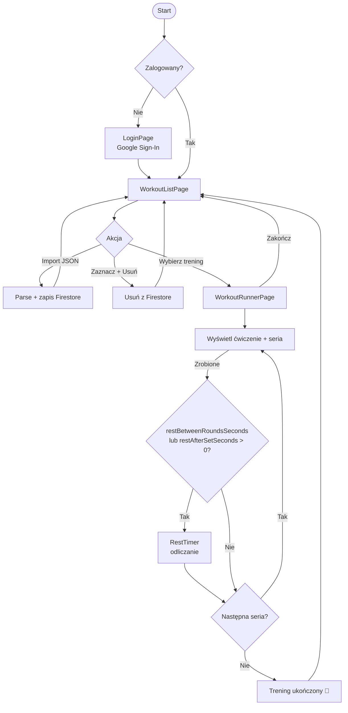

# 📱 Mobile Trainer — Dokumentacja Aplikacji

## 1. Cel i opis projektu

**Mobile Trainer** to progresywna aplikacja webowa (PWA) dostosowana do obsługi na urządzeniach mobilnych. Umożliwia użytkownikom importowanie planów treningowych z pliku JSON, a następnie prowadzi ich krok po kroku przez ćwiczenia z odliczaniem przerw.

---

## 2. Stack technologiczny

| Warstwa                | Technologia                        |
| ---------------------- | ---------------------------------- |
| Framework UI           | **React JS** (Vite)                |
| Biblioteka komponentów | **Material UI (MUI v5)**           |
| Baza danych            | **Firebase Firestore**             |
| Autoryzacja            | **Firebase Auth** — Google Sign-In |
| Hosting                | **Vercel**                         |
| Język                  | TypeScript                         |

---

## 3. Wymagania funkcjonalne (Use Cases)

### UC-1: Logowanie / Wylogowanie

- Użytkownik klika „Zaloguj się przez Google"
- Firebase Auth obsługuje OAuth flow z kontem Google
- Po zalogowaniu użytkownik trafia na listę treningów
- Przycisk wylogowania dostępny w Navbar (ikona konta)

### UC-2: Import planu treningowego (JSON)

- Na stronie głównej widoczny przycisk „Importuj trening"
- Użytkownik wybiera plik `.json` z dysku lub wkleja wartość w pole tekstowe
- Aplikacja parsuje plik i zapisuje trening w Firestore (kolekcja `/users/{uid}/workouts`)
- Trening pojawia się na liście

Dodatkowe szczegóły importu:

- Możliwości importu:
  - **Upload pliku**: wybierz plik `.json` z dysku (przycisk `Import` / FAB).
  - **Wklej JSON**: wklej zawartość pliku JSON w polu tekstowym w dialogu importu i kliknij `Importuj z tekstu`.
- Pola wymagane dla każdego treningu to: `name`, `description`, `scheduledAt`, `sets` (zgodnie z formatem powyżej). ID dokumentów w Firestore są generowane automatycznie podczas importu — nie musisz podawać `id` w pliku.
- Jeśli w Twoim JSON brakuje `plan.workouts` lub format jest nieprawidłowy, import zwróci błąd i nie zapisze danych.
- Import waliduje strukturę pliku przed zapisem. W przypadku brakujących pól (np. brak `name`, `sets` bez `exercises` itp.) import zostanie przerwany, a w UI zobaczysz komunikat z listą błędów walidacji.
- Nowo zaimportowane treningi są wyróżnione na liście etykietą `New` **tylko lokalnie w UI** (bez zapisu tego oznaczenia do Firestore).

**Format JSON pliku treningowego:**

```json
{
  "plan": {
    "name": "Plan tygodniowy",
    "createdAt": "2026-03-25T10:00:00Z",
    "workouts": [
      {
        "name": "Full Body Beginner",
        "description": "Prosty trening całego ciała",

        "scheduledAt": "2026-03-26T18:00:00Z",

        "sets": [
          {
            "setNumber": 1,
            "type": "circuit",
            "rounds": 3,

            "restBetweenRoundsSeconds": 90,
            "restAfterSetSeconds": 180,

            "exercises": [
              {
                "name": "Pompki",
                "description": "Klasyczne pompki",
                "reps": 12,
                "equipment": null
              },
              {
                "name": "Podciąganie",
                "description": "Nachwytem",
                "reps": 6,
                "equipment": "drążek"
              }
            ]
          }
        ]
      },
      {
        "name": "Lower Body",
        "description": "Trening nóg",

        "scheduledAt": "2026-03-28T17:00:00Z",

        "sets": [
          {
            "setNumber": 1,
            "type": "standard",
            "rounds": 4,

            "restBetweenRoundsSeconds": 120,
            "restAfterSetSeconds": 180,

            "exercises": [
              {
                "name": "Przysiady",
                "description": "Z kettlebell",
                "reps": 10,
                "equipment": "kettlebell 20kg"
              }
            ]
          }
        ]
      }
    ]
  }
}
```

> [!NOTE] > `restBetweenRoundsSeconds` — czas przerwy między rundami w ramach setu. `restAfterSetSeconds` — czas przerwy po całym secie (przed kolejnym). Wartość `0` oznacza brak przerwy.

### UC-3: Zarządzanie listą treningów

- Lista treningów posortowana wg daty (najnowsze na górze)
- Każdy element listy: nazwa treningu + data
- Długie przytrzymanie (lub checkbox) — tryb zaznaczania
- Można zaznaczyć wiele treningów i usunąć je jednocześnie (przycisk „Usuń" pojawia się w app barze)
- Pojedyncze kliknięcie — przejście do wykonywania treningu

### UC-4: Wykonywanie treningu

Trening przebiega iteracyjnie przez wszystkie ćwiczenia i serie:

```
[Ćwiczenie A – seria 1]
  → Użytkownik klika "Zrobione"
[Timer przerwy (np. 90s)] ← jeśli restSeconds > 0
  → Odliczanie widoczne na ekranie
  → Widoczne: następne ćwiczenie/seria
  → Można pominąć przerwę
[Ćwiczenie A – seria 2]
  → ...
[Ćwiczenie B – seria 1]
  → ...
[Ekran: Trening ukończony! 🎉]
  → Dokument treningu aktualizowany w Firestore (`status: "completed"`, `completedAt`)
```

Na każdym ekranie ćwiczenia widoczne są:

- Nazwa ćwiczenia
- Numer serii / całkowita liczba serii
- Liczba powtórzeń i ciężar
- Pasek postępu treningu
- Przycisk „Zakończ trening" (powrót do listy)
- Box z podsumowaniem kolejnego ćwiczenia

---

## 4. Architektura danych (Firestore)

```
/users/{uid}/
  workouts/{workoutId}/
    id: string
    name: string
    description: string
    scheduledAt: string (ISO)
    createdAt: timestamp
    status: string?          // "completed" po zakończeniu
    completedAt: timestamp?  // ustawiane przy zakończeniu treningu
    sets: array[
      {
        setNumber: number
        type: string          // "circuit" | "standard"
        rounds: number
        restBetweenRoundsSeconds: number
        restAfterSetSeconds: number
        exercises: array[
          {
            name: string
            description: string
            reps: number
            equipment: string | null
          }
        ]
      }
    ]
```

### Reguły bezpieczeństwa Firestore

```js
rules_version = '2';
service cloud.firestore {
  match /databases/{database}/documents {
    match /users/{userId}/{document=**} {
      allow read, write: if request.auth != null && request.auth.uid == userId;
    }
  }
}
```

---

## 5. Struktura komponentów React

```
src/
├── main.tsx
├── App.tsx                    # Router + Auth provider
├── firebase.ts                # Konfiguracja Firebase
│
├── contexts/
│   └── AuthContext.tsx        # useAuth hook
│
├── pages/
│   ├── LoginPage.tsx          # UC-1
│   ├── WorkoutListPage.tsx    # UC-2, UC-3
│   └── WorkoutRunnerPage.tsx  # UC-4
│
├── components/
│   ├── Navbar.tsx
│   ├── WorkoutCard.tsx
│   ├── ExerciseView.tsx       # Widok aktualnego ćwiczenia
│   ├── RestTimer.tsx          # Timer przerwy
│   └── ImportFab.tsx          # Floating button importu JSON
│
└── hooks/
    ├── useWorkouts.ts         # CRUD Firestore
    └── useWorkoutRunner.ts    # Logika iteracji przez trening
```

---

## 6. Kluczowe przepływy ekranów



---

## 7. Responsive / Mobile First

- Wszystkie widoki zaprojektowane z myślą o ekranach **360px+**
- MUI `BottomNavigation` lub `Fab` jako główna nawigacja
- `useSwipeable` do gestów (opcjonalnie – cofnięcie / pominięcie)
- Zapobieganie usypianiu ekranu podczas treningu: **Wake Lock API**

---

## 8. Deployment — Vercel

### Zmienne środowiskowe (`.env`)

```
VITE_FIREBASE_API_KEY=...
VITE_FIREBASE_AUTH_DOMAIN=...
VITE_FIREBASE_PROJECT_ID=...
VITE_FIREBASE_STORAGE_BUCKET=...
VITE_FIREBASE_MESSAGING_SENDER_ID=...
VITE_FIREBASE_APP_ID=...
```

### Kroki wdrożenia

1. Połącz repozytorium GitHub z projektem Vercel
2. Dodaj zmienne środowiskowe w panelu Vercel → Settings → Environment Variables
3. Build command: `npm run build`
4. Output directory: `dist`
5. Każdy push do `main` → automatyczny deploy

> [!IMPORTANT]
> W Firebase Console → Authentication → Authorized domains dodaj domenę Vercel (np. `mobile-trainer.vercel.app`), inaczej Google Sign-In nie zadziała.

---

## 9. Fazy realizacji (kolejność budowania)

| Faza  | Zakres                                                          |
| ----- | --------------------------------------------------------------- |
| **1** | Inicjalizacja projektu (Vite + React + MUI + Firebase)          |
| **2** | Autoryzacja Google (LoginPage, AuthContext, PrivateRoute)       |
| **3** | Lista treningów + import JSON (WorkoutListPage, Firestore CRUD) |
| **4** | Usuwanie treningów (tryb zaznaczania)                           |
| **5** | Wykonywanie treningu (WorkoutRunnerPage, RestTimer)             |
| **6** | Polish: animacje, Wake Lock, PWA manifest                       |
| **7** | Deploy na Vercel + konfiguracja Firebase domains                |
